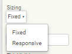
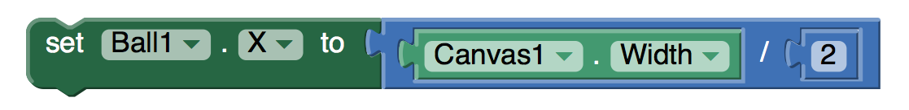
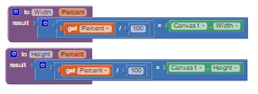

[&laquo; 返回首页](index.html)

Responsive Design in App Inventor
version 1.0: August 15, 2015

Responsive Design in App Inventor

1. Specifying sizes as percentages

2. Fixed vs. responsive sizing

3. Detailed example

4. Special circumstances

5. Limitation: Drawing and animation

6. Responsive design and Google Play

One tricky issue in designing apps is making apps that look good on devices with screens of differing sizes.  For example, apps designed for a given phone should also look good on tablets or phones with a different screen size.  Making apps that have this property is called responsive design.  

A common approach to responsive design is to build apps that include multiple layouts and multiple images to accommodate different screen sizes and resolutions.  This gives good results, but it makes more work for developers.  App Inventor uses a simpler approach, but that approach is more limited in terms of the kinds of apps it can handle.  

 
### 1. Specifying sizes as percentages
There’s one important rule when using App Inventor to create apps with responsive design:

Specify widths and heights of components as percentages of the screen width and height, rather than as fixed numbers of pixels.

For example, to make a button whose width is half the screen width, set the button’s width to be 50 percent rather than setting it to a specific number of pixels.

“Percentage” here means percentage of the screen width or height, not percentage of a containing component.   For a button inside a horizontal arrangement, a width of 50 percent means half the screen width, not half the width of the arrangement.

You can also specify widths and heights using “fill parent” and “automatic” just as always in App Inventor.

### 2. Fixed vs. responsive sizing
Many developers will not want to change the way they are building apps, merely to provide responsive design.   To accommodate this choice, App Inventor includes a screen property called Screen.Sizing.  Screen.Sizing can be set to either fixed or responsive.   When sizing is fixed, App Inventor creates apps for a screen of size 320 pixels wide and 460 pixels high, but it scales the app’s appearance to match the actual size of the screen that the app is running on. This display is essentially equivalent to how App Inventor apps were rendered on Tablets prior to App Inventor version 145.

There are no Blocks to set Responsive / Fixed. To change the Screen.Sizing property, on the Designer screen   with Screen1 selected in Components, go to Properties on the right-hand side of the App Inventor. You will find a box below “Sizing” that usually defaults to Fixed, located about 2/3 down. This property is set project-wide.

When sizing is set to responsive, App Inventor apps use the actual number of pixels for the device the app is running on.  This number might be different for different devices.

Here is how we recommend working with App Inventor:

If you are currently working on an app that uses fixed sizing, or you have an old app that you don’t want to change, or you care only about a single screen size, then set sizing to fixed.  The display users will see will be very similar to the display in pre release 145 apps.

If you are making a new app, set sizing to responsive and specify widths and heights as percentages rather than numbers of pixels.   For example to set the width of a button to 50 percent of the screen width, you can set the width in the designer by specifying it as a percent:

You can also set percentage sizes in the block editor using the WidthPercent and HeightPercent properties:

You can also use automatic and fill parent.  

One major exception to these rules is when working with a Canvas and creating drawings and animations, as explained in “Limitations” below.

### 3. Detailed example
Here’s a detailed example illustrating the difference between fixed and responsive sizing:

Suppose you have an app that includes a button and you’d like the button width to be half the screen width.  You build your app on a phone whose resolution is 320×460.  You set the button width to 160 (half the screen), and you set sizing to fixed.  If you ask App Inventor what the button width is, the result will be 160 and screen width will be 320.

Suppose you build  the same app on a tablet whose resolution is 600×860, still with sizing set to fixed.   If you ask App Inventor what the widths are, the button width will still be 160 and the screen width will still be 320, and the image on the tablet will be expanded to fill the entire screen.  App Inventor will treat the larger tablet screen as if the width were only 320.   As result, you can’t take advantage of the higher resolution to make the app look better.   For example, fonts will still be the lower resolution fonts, even though tablet display could look nicer.  The fonts might also look too large, because they are sized for a 320×460 screen and then scaled up to the actual screen size of the device.

In contrast, suppose you build the same app with the button width set to 50% and sizing set to

responsive.  On the phone, things will be the same as before; screen width will be 320 and button width will be 160.   But things will be different on the tablet.  App Inventor will report the screen width as 600 and the button width as 300.    As a result, you have the extra resolution to work with in your app design for the tablet.

It’s also possible to take mixed approaches.  These can be more confusing and less useful, and we recommend that you use them only in special circumstances.   Here’s how they behave:

Using percentages with fixed sizing:  Suppose you set sizing  to fixed, and set the button width to be 50%.   On the phone,  App Inventor will report the button width as 160 and the screen width as 320.  Similarly, on the tablet, the button width will still be 160 and the screen width 320.

Using pixels with responsive sizing:  Suppose you set sizing to responsive and set the button width to 160.  On the phone, things will be the same as before: screen width 320 and button width 160.   But on the tablet, with screen  width  600 the button width will still be 160, which is much less than half the screen width.   As a result the layout on the tablet will look different from the layout on the phone, which is probably not what you want.

In general, we recommend as above that you use percentages and responsive sizing for new apps, and use pixels and fixed sizing  for working on existing apps that you don’t want to change, or new apps where you don’t care about them running on devices with different resolution screens.

### 4. Special circumstances
There are situations where you might want to specify sizes in pixels even though you are using responsive sizing.

One situation is where you have a low-resolution image that looks good at a width of 300 pixels, but not at 500 pixels or more.   In that case, you might want to set the width of the image component to be 300, even with sizing set to responsive.   As a consequence, your app will look different on the phone and the tablet because the image will the same size, although the screen sizes will be different.   This is the situation where developers using more advanced tools can provide multiple copies of the image for use with different screen sizes.  MIT has not built anything in App Inventor to support such multiple images, but we might do that if there is enough demand.

### 5. Limitation: Drawing and animation
App Inventor’s features to support responsive design are limited and incomplete.   One place where this limitation shows up is in drawing on the canvas and using sprites for animation.   Many apps use coordinate values for making drawings and controlling interaction, and this can become complicated to arrange in dealing with multiple screen sizes.   For now, we recommend  three approaches:

Use fixed sizing for these apps, i.e., don’t use responsive design here.

Use responsive sizing, but set the size of the canvas to be a fixed number of pixels.  In other words, while the rest of your app can be responsive, the canvas (and the drawings within it) will have fixed size.   You’ll have to choose the fixed size, though, and that size might not look good on all devices.

Use responsive sizing and set the canvas size to be an appropriate fraction of the screen size.  Then, within the canvas, do arithmetic to compute coordinates to make things relative to the actual canvas size.   This will give the best results, but it can be complicated if there is a lot of drawing and animation.

For example, suppose you have a canvas whose width is the width of the screen and you want to put a ball in the middle of the canvas.   With fixed sizing you could know the width of the canvas when you built the app, and could set the ball’s X coordinate to that number in the designer.   But for responsive sizing you would need to use compute the X coordinate when the app runs, like this:

That’s not as straightforward as setting the coordinate to a fixed number in the designer.  But it’s what you’d need to do if you want your app to look the same on screens of different resolutions.

You might wish to create procedures to size and position Balls and ImageSprites on the Canvas as shown below. The Percent arguments would be relative to the Canvas Width and Height, rather than the Screen Width and Height of the other components.

None of these approaches is totally satisfactory.  We may later add features to App Inventor to improve things based on User’s  App Inventor experience with responsive design.

Note: At the moment, you cannot scroll through a Canvas component with AI2. [a]When you use the Canvas on a scrollable screen, leave a margin on the right or left or both sides of the screen that can be used to scroll beyond the Canvas (assuming there are more visual components “beneath” the Canvas).  Simply, if you want to “scroll through” a Canvas, never set the Canvas.Width to the Screen.Width.

<suggestion/>I recommend rewording this to include what I have experienced with a recent map project. The map is larger than the device screen in both width and height. The Canvas itself can be dragged by sizing containing Screen arrangements using the Canvas Dragged arguments. See: https://groups.google.com/forum/#!category-topic/app-inventor-developers-library/other/hkt7gyMO2nU

(Scott Ferguson)</suggestion>

### 6. Responsive design and Google Play
Google Play is Google’s market for Android Apps.  App Inventor users can upload their apps to Google Play.  (See Publishing Apps to Google Play.)  Google Play takes account of the device on which an app is to be installed, and tries to present only those apps that are compatible with the device, including whether the device is a phone or a tablet.

Apps created with App Inventor are considered to be compatible both with phones and with tablets and can be installed on both kinds of devices.   If you are downloading from Play to a tablet, however, you might see the comment  “designed for phones”.   This won’t prevent your app from running, but it’s an indication that Google has certain design guidelines that they would like tablet apps to follow, such as providing multiple copies of images and different component layouts for screen of different resolutions.   These  guidelines are generally not possible to follow with App Inventor.
