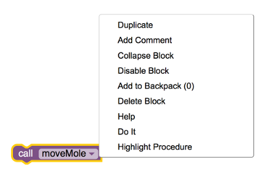
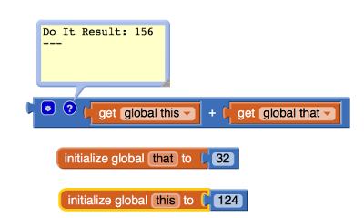
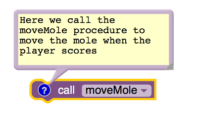

* TOC
{:toc}

[&laquo; 返回首页](index.html)

## 实时开发、测试和调试工具

当你使用 App Inventor 创建应用程序时，你正在手机上实时工作：将按钮图标拖动到查看器，然后该按钮就会立即出现在手机上； 在设计器中更改按钮的颜色，颜色就会发生变化； 拖出一个块，按下按钮时会发生一些事情，然后你可以在手机上立即按下按钮来查看它发生的情况。

这种反馈非常有用，因为它可以让你逐步开发和测试应用程序，定义每一个新行为并在进行过程中进行测试。 缺乏经验的程序员经常会犯这样的错误：在测试任何东西之前就构建了大量的东西。 然后，当他们遇到错误时，他们将面临巨大的混乱，他们不知道哪些部分在工作，哪些部分不起作用。 所以尝试循序渐进地工作。 你仍然肯定会遇到错误，但增量开发将使你更快地隔离错误并更轻松地修复它们。

除了让你通过与手机本身交互来尝试之外，App Inventor 还包含在你使用块编辑器时帮助测试和调试的功能。 如果右键单击块，你可以看到这些。 这将打开一个菜单，如下所示，调用过程 moveMole 的块：

并非所有区块都会在菜单中提供相同的选择。

你可以使用 Do It 执行块的操作。 在调试像 MoleMash 这样的程序时，你可以选择“MoveMole”中的“Do It”，然后查看摩尔是否在手机上移动。

Do It 不仅会执行块的操作，还会弹出一个气球来显示返回的值。 下图显示了在加法块上使用 Do It 来显示两个名为 this 和 that 的数字相加的结果。 这也充当注释块，因此你可以将注释添加到 Do It 结果窗口。

结果气球附着在块上由小问号指示的点处。 你可以单击问号来隐藏和显示结果。 你还可以通过右键单击并选择删除注释来完全删除结果块和注释。

### 禁用代码块

有时你想保留一个不属于你的应用程序的块。 也许它是程序中尚未完成的一部分，或者是仅部分实现的块。 右键单击某个块，然后从弹出菜单中选择禁用块，将阻止该块在打包时成为应用程序的一部分。 选择启用块可恢复禁用的块。

### 折叠代码块

如果你的应用程序有很多块，它们将无法同时全部显示在屏幕上。 你需要滚动“块编辑器”窗口，这可能会很尴尬。 帮助保持屏幕空间较小的一种方法是使用块折叠。 如果右键单击过程块或事件处理程序块，则可以从弹出菜单中选择“折叠块”。 该块将折叠，以便只有标题可见。 再次右键单击并选择“展开块”会将块恢复为完全可见。

### 代码块注释

向块添加注释是帮助其他人理解你的程序的好方法。 它对于跟踪你自己的程序也很有用。 从弹出的块菜单中选择“添加注释”会弹出一个附加到该块的气球，你可以在其中键入注释，如下所示：

你可以拖动气球，或调整其大小。 注释气球附加在块上带有小问号的位置，你可以单击该问号来隐藏和显示注释。 或者，你可以通过右键单击该块并选择“删除注释”来永久删除注释。 请注意，这与 Do It 命令的结果窗口是同一个窗口。

### 错误

有时执行块的结果会是错误。 在下图中，我们将 this 的值更改为文本“apple”，然后单击“Do It”来添加这个和那个。 结果是一个错误，由带有感叹号的红色三角形表示。 如果单击感叹号，则会出现一个包含错误的弹出窗口。

你可以单击感叹号来隐藏和显示错误窗口。 你还可以通过从块弹出菜单中选择“清除错误”来删除错误完成。

### [对话框](../components/userinterface.html#Notifier)组件

调试程序的另一种方法是使用[对话框](../components/userinterface.html#Notifier)组件。 如果你想在程序中的特定点显示某些信息，请使用[对话框](../components/userinterface.html#Notifier)来显示该信息。 它可以只包含一条消息，也可以显示某些变量的值。 当你调试完应用程序并且确定它按预期工作时，你必须禁用[对话框](../components/userinterface.html#Notifier)块或从应用程序中完全删除该组件。

### [标签](../components/userinterface.html#Label)组件

以与上述相同的方式，你可以在应用程序中设置调试标签。 你可以添加块以将标签文本设置为消息或变量值，以便你可以在更改发生时进行跟踪。 当你调试完应用程序并且确定它按预期工作时，你可以使标签在设计器中不可见，和/或可以禁用设置文本值的块。 如果你确定不再需要它们，也可以完全删除标签。

## 系统日志

除了块编辑器中的调试工具之外，你有时还可以从各种日志中获取信息。 这通常仅适用于高级用户。

### Android 日志和 adb（高级）

如果你在 Android 设备上遇到问题，有时可以通过检查 Android 日志来获取信息。 例如，如果你的应用程序空间不足，则会记录在日志中。 日志中的消息通常难以理解，但是你可以使用通知程序组件使你的应用程序将消息写入日志中，这在调试时可能会有一些用处。

你可以使用 Android 调试桥 (adb) 读取日志。 adb 程序作为 App Inventor 安装过程的一部分安装在你的计算机上，你可以使用 logcat 选项查看日志。 你可以从计算机上的终端启动 adb。 转到包含 AppInventor Extras 软件的目录并运行命令 adb logcat

这将显示整个（大）系统日志。 如果你正在调试，则应该打开日志，再次模拟该错误，然后查看日志末尾出现的内容。

adb 的实际目录取决于你的操作系统：

* 对于 MacO，它是 /Applications/AppInventor/commands-for-Appinventor。
* 对于 GNU/Linux，它是 /usr/google/appinventor-extras/commands-for-Appinventor
* 对于 Windows，它可以位于多个位置之一，具体取决于它的安装方式。 在你的计算机上搜索 \Android\appinventor-extras 文件夹，其中包含文件 adb.exe。

有关 adb 的更多信息，请参阅 Android 调试桥网页。

### Javascript 控制台日志（高级）

并非所有错误都会是你的错误。 App Inventor 也存在错误，你可能会遇到它们。 除了报告错误之外，你在此处无能为力，但通过使用浏览器的开发人员工具显示控制台日志，你可能会了解正在发生的情况，或者至少获得报告错误消息的信息。

块编辑器是一个 Javascript 程序，它的许多操作都会将消息写入 Javascript 控制台日志。 如果你在浏览器的开发人员工具打开的情况下运行块编辑器，你可以看到这些消息。

详细信息取决于你使用的浏览器：

* 对于 Firefox，转到工具 -> Web 开发人员 -> Web 控制台
* 对于 Chrome，转到工具 -> JavaScript 控制台
* 对于 Safari，转到工具 -> 开发人员 -> Web 检查器 -> 控制台
