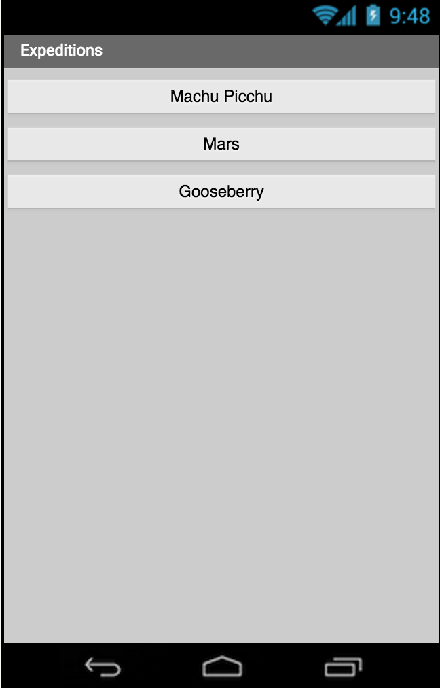
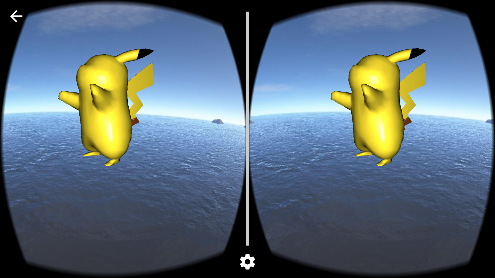

* TOC
{:toc}

[&laquo; 返回首页](index.html)

## 使用虚拟现实和App Inventor进行实验

该项目是麻省理工学院 App Inventor 2011 年 Google Summer of Code 活动的一部分。它描述了使用 Google Cardboard SDK 为 App Inventor 添加虚拟功能的实验。有两个演示项目可以作为未来实验的基础。

## 简介

人们对虚拟现实 (VR) 和增强现实 (AR) 应用程序的兴趣正在激增。就在上个月，Pokémon Go 成为有史以来最大的手机游戏，这必将激发人们对 VR 和 AR 应用程序的更多兴趣，这些应用程序不仅可以用于游戏和娱乐，还可以用于教育和科学。虽然 VR 和 AR 应用已经存在 30 多年，但这项技术现在可能即将成为主流。VR/AR 应用的蓬勃发展伴随着大量用于观看设备和其他配件的产品推出。其中一些产品非常昂贵，但至少有一款产品——Google Cardboard——价格低至 15 美元，随处可见。您甚至可以从头开始制作自己的观看设备。

对于 App Inventor 来说，其目标是让每个人都能创建移动应用程序，这一技术转变为初学者提供了一个机会，使他们能够为 Cardboard 和其他观看设备创建自己的原创 VR/AR 应用程序。

在过去的一年里，Google Cardboard 的应用程序开发变得越来越简单，但对于典型的 App Inventor 用户来说，它仍然不够简单。2016 年夏季编程项目的目标是研究将 Cardboard 功能集成到 App Inventor 中的方法。本文介绍了两个原型应用程序，一个显示沉浸式全景图，另一个添加了 3-D 建模。我们提供了可供下载和试用的演示 APK 文件，以及您可以用作演示变体起点的 App Inventor 项目 (aia) 文件。演示的核心是一个用 Java 编写的辅助应用程序，用于管理与 Cardboard 库的交互。具有 Java 和 Android 经验的开发人员可以将其用作指南，为 App Inventor 社区创建更丰富的 Cardboard 集成可能性。开发人员还应注意，刚刚发布的 Android 系统 7 (Nougat) 包含 Google 的 Daydream VR 软件，这应该可以简化实现此类演示的任务。

## 虚拟现实演示应用程序
注意：在 App Inventor 中使用 Cardboard（包括试用这些演示）需要运行 Android 系统 4.3 或更高版本的设备。

为了在您的 Android 设备上查看这些演示，您需要安装 Cardboard 应用程序。如果您还没有安装，请前往 Google Play 商店并安装名为 Google Cardboard 的应用程序。

安装 Cardboard 应用后，即使不使用查看器，也可以运行演示：根据演示设置，您会看到响应手机移动的图片或显示双眼图像的分屏。但您应该使用查看器以获得完整效果。如果您没有查看器，您可能首先想尝试没有查看器的演示，然后获取查看器进行更多探索。访问 Google 商店以查找各种 Cardboard 查看器，或在网上搜索有关如何制作自己的 Cardboard 查看器的提示。您还可以使用 Cardboard 以外的查看器。

## Expeditions

Expeditions 演示显示沉浸式 360 度全景图。Google 于 2014 年在 Google I/O 2014 的主题演讲中首次介绍了此功能。从那时起，Google 就使用 Cardboard 和全景功能作为​​ VR 教学工具的基础，让学生可以虚拟游览国家、博物馆，甚至探索水下。结合适当的声音伴奏，这试图使虚拟游览尽可能接近现实。

以下是演示在智能手机上的显示方式，显示了火星探测器拍摄的一幅全景图，以及从秘鲁遗址马丘比丘拍摄的另一幅全景图。


还有一个纸板图标，可让您从屏幕全景视图切换到纸板视图，以便您可以使用纸板查看演示。

第二个例子来自火星探测器探险。这是一张可在纸板中查看的火星探测器图像全景图。以下是视频链接，展示了当您移动手机时应用程序如何制作全景动画：[https://youtu.be/Ps3lchduJlI](https://youtu.be/Ps3lchduJlI)


我们甚至可以看到您最喜欢的故事书中的英雄。很漂亮，对吧？以下是 Google Cardboard 的全景图截图：


## 运行 Expeditions 演示

要在手机上运行 Expeditions 演示，您首先需要下载并安装一个名为 MITVRHelper 的辅助应用程序，该应用程序为 App Inventor 提供 VR 功能。这是一个 Java 应用程序，而不是 App Inventor 应用程序。在手机上安装后，您无需启动它。App Inventor 演示应用程序将自动启动。您可以在此处下载辅助应用程序：

[MITVRHelper.apk](apk/MITVRHelper.apk)

接下来，下载并安装实际的 Expeditions 应用程序。以下是 APK 文件：

[expeditions.apk](apk/expeditions.apk)

当您在手机上启动 Expeditions 应用程序时，您将看到主屏幕，其中提供了一系列全景图：



当您选择其中一个全景图时，您将首先看到一个初始屏幕（与任何 Cardboard 应用程序中的屏幕相同），要求您选择一个 Cardboard 设备并将手机安装在其中。如果您尚未安装 Cardboard 应用程序，Google 会要求您安装它。Google 会向您显示安装链接以及说明。

另外，请记住，您需要在手机上安装 Android 4.3 或更高版本才能运行此示例。我们知道许多 App Inventor 用户的操作系统版本较低。

## 虚拟性

第二个 VR 演示项目是 Virtuality。它展示了一个全景图，其中包括一个从 3D 模型生成的 3D 对象。此演示中的对象是来自口袋妖怪游戏的皮卡丘。以下是应用程序在 Cardboard 视图中的外观：



3D 模型可以实现的一项令人兴奋的功能是动画，因此为了使模型更具交互性，我们添加了独立于背景全景移动的皮卡丘旋转。下图和以下简短视频链接演示了移动手机时动画的显示方式：https://youtu.be/DwA6LmZZhDs


要在手机上运行 Virtuality 演示项目，您需要安装两个 Android 应用程序（APK 文件）：

MIT VR 辅助应用程序，处理虚拟现实实现。这是与 Expeditions 演示相同的辅助应用程序：MITVRHelper.apk
App Inventor 应用程序，处理主要应用程序逻辑：virtuality.apk

现在在手机上启动名为“Virtuality”的 App Inventor 应用程序，您将看到主屏幕，它允许您使用皮卡丘模型启动 360 度全景图。


## 将演示创建为 App Inventor 项目

Expeditions 和 Virtuality 演示都非常简单 - 就 App Inventor 编程块而言。它们仅使用 ActivityStarter 组件来启动与 MITVRHelper 辅助应用程序一起打包的活动之一。ActivityStarter 需要指定要启动哪个活动，以及要处理哪个全景图或对象模型文件。通过设置 ActivityStarter 的 DataURI 属性来指定文件。

## 一个尴尬的细节

全景图或对象文件通常使用 App Inventor 设计器上传，作为应用程序的媒体文件。App Inventor 会将其作为应用程序的资产之一保存在手机上。在这种情况下，Android 的安全系统将阻止任何其他应用程序访问该资产。特别是，MITVRHelper 无法使用资产文件。解决这个问题的方法是将资产文件复制到手机存储的另一部分，并让 MITVRHelper 访问副本。

更尴尬的是：标准 App Inventor 不包含复制文件的操作。幸运的是，由于 Taifun Bär（谢谢 Taifun！），有一个 App Inventor 扩展，它提供了一个带有 TaifunFile.copy 操作的组件 TaifunFile。可以从此处下载扩展。您应该在构建 Expeditions 和 Virtuality 演示之前安装扩展。有关如何使用 App Inventor 扩展，请参阅 App Inventor 扩展文档。

这些 VR 项目的下一个版本将消除文件复制和加载扩展的需要。

## 演示应用程序的总体结构

应用程序（对于 Expeditions 或 Virtuality）的总体流程如下：


因此，要在 App Inventor 中创建任一演示，请按以下步骤操作：

- 确保手机上安装了 MITVRHelper 应用程序。
- 启动新的 App Inventor 项目
- 下载并安装 TaifunFile 扩展
- 将全景图像或 3D 模型文件上传到项目资产（使用 App Inventor 设计器中的媒体部分）
- 向屏幕添加将触发事件的交互 - 例如，应用程序用户可以按下的按钮。
- 从调色板中添加 TaifunFile 组件。
- 添加 ActivityStarter，并将其操作设置为适当的活动（见下文）
- 当触发事件时（例如，按下按钮时）
- 使用 TaifunFile.copy 操作将资产文件复制到手机文件系统中的适当位置（见下文）
- 将 ActivityStarter DataURI 设置为复制的结果
- 调用 ActivityStarter startActivity 操作。

## Expeditions 应用程序

Expeditions 项目遵循上述大纲，制作一个显示 360 度全景图的应用程序。全景图是一种特殊的图像文件，您可以将其上传到 App Inventor 项目，与其他媒体文件类似。与普通图像不同，此文件在单个文件中包含两幅图像。这样做是为了支持 Cardboard 查看，因为这是一张立体全景图。

## 获取 Cardboard 的全景图

Cardboard SDK 支持单声道和立体 360 度图像。图像需要以等矩形全景 (equirect-pano) 格式存储，这是许多捕获解决方案支持的通用格式。

您可以使用 Google Cardboard 相机应用程序创建自己的 Cardboard 全景图，该应用程序允许您使用相机拍照并以适合 Cardboard 全景查看的格式上传照片。

## 创建 App Inventor 项目

Expeditions 项目包含两个应用程序：(1) 主应用程序 Expeditions.aia，您将使用 App Inventor 创建它；以及 (2) 辅助应用程序 MITVRHelper，您可以从 Web 单独下载该应用程序并将其作为 MITVRHelper.apk 安装在手机上。辅助应用程序将在下一节中更详细地描述。

注意：当我们稍后将 MITVRHelper 修改为 App Inventor 扩展时，无需单独下载它。

您还需要安装 TaifunFile 扩展，如上所述。该扩展可在此处下载。

以下是用于构建扩展主应用程序的 App Inventor 组件：


我们使用 ActivityStarter 组件启动辅助应用程序并将参数传递给它，以下是必需的 ActivityStarter 组件属性，应在 App Inventor Designer 中指定。

- Action 即 `android.intent.action.MAIN`；
- ActivityClass 应指向应用程序活动类（对于此演示，它是 `com.appinventor.cardboard.ui.PanoramaActivity`）
- ActivityPackage 即 `com.appinventor.cardboard`

对于应用程序的块部分，唯一需要的 App Inventor 块是按钮单击的事件处理程序。每个事件处理程序将 ActivityStarter.DataUri 设置为适当的全景图像并启动活动。但首先，我们需要将全景资产文件复制到 MITVRHelper 活动可以访问的位置，如上所述。对于复制副本中的源文件，URL 是图像资产的名称，前面有两个斜杠。对于目标，请使用 /mnt/sdcard/AI/filename。

以下是该应用程序的完整块画布：


## 虚拟性应用程序

Virtuality 应用程序与 Expeditions 应用程序几乎完全相同。不同之处在于 Virtuality 可以使用在 Blender 开源 3D 建模框架中创建的 3D 模型。模型以 obj 格式 (Wavefront) 存储，并且可以另外提供纹理。在维基百科上，您可以在此处阅读有关此格式的更多信息。有很多网站提供免费的 3D 模型，例如这个、这个和这个。

与 Expeditions 一样，主应用程序 (virtuality.apk) 是使用 App Inventor 构建的。我们采用使用 ActivityStarter 组件来启动辅助应用程序 (MITVRHelper.apk) 的方法。辅助应用程序与 Expeditions 相同，但我们指定了不同的活动类：VirtualActivity。与 Expeditions 的另一个不同之处在于，我们将两个文件传递给辅助程序：一个模型（表示为 obj 文件）和对象的纹理（表示为 png 文件）。不幸的是，此版本的演示忽略了纹理输入并使用默认纹理。我们将纹理文件操作保留在 aia 文件和下面的块图像中，因此当我们升级 MITVRHelper 时，您可以看到它以供将来参考。模型使用 ActivityStarter 的 DataUri 属性指定。文本使用 ActivityStarter ExtraValue 属性和关键字纹理指定。这里的问题是，MITVRHelper 最终忽略了纹理输入，因为 3D 引擎期望找到纹理文件的位置存在限制。我们将在未来的版本中处理这个问题，并使纹理输入正常工作。

以下是 Virtuality 项目的组件 - 与 Expeditions 相同


以下是作为媒体包含的对象模型和纹理文件：


我们在设计器中设置了 Activity Starter 的以下属性（与 Expeditions 类似，但活动类不同）：

- Action 即 `android.intent.action.MAIN`；
- ActivityClass 应指向应用程序活动类（对于此演示，它是 `com.appinventor.cardboard.ui.VirtualActivity`）
- ActivityPackage 即 `com.appinventor.cardboard`

这是按下按钮时启动视图的事件处理程序。我们需要复制 obj 文件和纹理文件，使助手可以访问它们。请注意，我们不仅要设置 DataUri，还要设置 ExtraKey 和 ExtraValue。这是应用程序所需的唯一块。


为方便起见，这里是完成的 virtuality.aia 项目文件，您可以将其下载到 App Inventor 并构建。请记住，您还需要辅助应用程序 MITVRHelper。

## 用于Cardboard 的 MITVRHelper 应用程序

MITVRHelper 是一个用 Java 编写的 Android 应用程序。您可以在此处下载包含完整应用程序代码的 zip 文件。要使用代码，请将其解压缩并导入 Eclipse 或 Android Studio 进行修改和构建。您可以在此处下载应用程序的预构建版本。

辅助应用程序充当 App Inventor 和 Android SDK 中的一些 VR 库之间的链接。它需要运行系统 4.3 或更高版本的 Android 设备。

该应用程序由两个单独的活动组成：

- PanoramaActivity 支持 Expeditions 演示
- VirtualActivity 支持 Virtuality 演示

以下部分为熟悉使用 Java 构建 Android 应用程序的人展示了代码的亮点。其他人只需下载并安装 apk 即可使用 App Inventor 演示应用程序

## 支持 Expeditions：PanoramaActivity.java

Panorama 活动提供 3D 远程呈现体验。它基于 Cardboard SDK 中的 VrPanoramaView 类。这是一个创建和处理 360 度立体和单声道全景图的简单视图。当 Android 设备垂直对齐时，视图仅显示单声道图像，但可以旋转它。当设备水平对齐时，视图将自动切换到“Cardboard”立体模式。

要创建这样的项目，您应该执行以下步骤：

- 导入 Android 模块 common、commonwidget、panowidget
- 将全景对象视图添加到您的项目屏幕布局 (com.google.vr.sdk.widgets.pano.VrPanoramaView)
- 调用 VrPanoramaView.loadImageFromBitmap 方法，该方法采用全景位图和渲染选项。

以下是 VrPanoramaView 的主要部分：

VrPanoramaView 类从 VrWidgetView 扩展而来，包含 VrPanoramaRenderer 和 VrPanoramaEventListener。 VrWidgetView 类从 FrameLayout 扩展而来，包含 OpenGL 场景和控件。

具有包保护的 VrPanoramaRenderer 从 VrWidgetView 扩展而来，并实现位图加载逻辑，然后从 panowidget.aar 调用本机 arm 库 panorenderer。

VrWidgetView 同时包含 VrWidgetRenderer 和 VrEventListener，并处理它们之间的交互。

VrWidgetRenderer 从 OpenGL（Java）实现 Renderer 接口，并根据 Renderer 调用 onSurfaceCreated、onSurfaceChanged、onDrawFrame 调用本机函数。

查看此结构，我们可以看到创建一个将渲染位图并可以在 Mono 和 Stereo 中查看它们的应用程序非常简单。但是，如果您需要实现一些动态内容，例如位图上的标记、从相机抓取图像或订阅渲染器事件，您会发现 VrPanoramaView 不提供这样的功能。希望 Google 将来能实现这一点。

对于 MITVRHelper，我们的 PanoramaActivity 扩展了常规的 AppCompatActivity，并处理传入的意图。

```java
public class PanoramaActivity extends AppCompatActivity {


    private Uri uri;

    private VrPanoramaView panorama;

    private Options options = new Options();

        

        @Override

    protected void onCreate(Bundle savedInstanceState) {

        super.onCreate(savedInstanceState);

        setContentView(R.layout.activity_main);

        panorama = (VrPanoramaView) findViewById(R.id.panorama);

        panorama.setEventListener(new ActivityEventListener());

        handleIntent(getIntent());

    }

   

    private void handleIntent(Intent intent) {

        if (intent.getData() != null) {

            uri = intent.getData();

        }

        ...

    }

}
```

要将全景图加载到此视图中，我们应该加载和解码 png/jpeg 全景图并将其传递到视图对象中。我们将为此使用 AsyncTask 以防止 UI 滞后。图像 URI 是从传入的意图中获取的。以下是有关如何实现此操作的简短代码片段：

```java
options.inputType = Options.TYPE_STEREO_OVER_UNDER;


        if (imageLoaderTask != null)

            imageLoaderTask.cancel(true);


        imageLoaderTask = new ImageLoaderTask();

        imageLoaderTask.execute(Pair.create(uri.toString(), options));


 class ImageLoaderTask 

         extends AsyncTask<Pair<String, Options>, Void, Boolean>

{

        @Override

        protected Boolean doInBackground(Pair<String, Options>... pair) {

            try (InputStream is = new FileInputStream(new File(pair[0].first))) {

                panorama.loadImageFromBitmap(BitmapFactory.decodeStream(is)

, options);

            } catch (IOException e) {

                Timber.e("Error loading image", e);

            }

            return true;

        }

}
```


当然，我们不应该忘记活动的生命周期，以及在活动被销毁时清理资源的需要：

```java
@Override

protected void onPause() {

panorama.pauseRendering();

      super.onPause();

}


@Override

protected void onResume() {

super.onResume();

      panorama.resumeRendering();

}


@Override

protected void onDestroy() {

panorama.shutdown();

if (imageLoaderTask != null)

              imageLoaderTask.cancel(true);

      super.onDestroy();

}
```

## 支持 Virtuality：VirtualActivity.java

VirtualActivity 比 PanoramaActivity 复杂得多。它依赖于官方 Cardboard SDK 和 Jmini3d 3D 引擎。之所以选择此引擎，是因为它的简单性、精心设计的 API 和完整的 Android 集成。然而，在开发过程中，我们遇到了几个与资源文件夹严格依赖性相关的问题。这使得无法传递外部纹理文件并将其与模型一起使用。当然，由于此引擎是开源的，我们可以重写它，但正如结论中写的那样 - 最好选择更现代、更简单的引擎，如 Unity。动画、环境、3D 模型、文档 - 所有这些都使其成为最佳解决方案。

Virtuality 应用程序向用户展示了各种各样的交互和内容。从游戏开发到教育应用程序，向用户展示世界和事物是如何构建的。它可以是人体的 3D 模型，也可以是一些恐龙。

辅助应用程序中有一个活动，用于处理世界环境渲染以及模型动画和纹理。此活动扩展了 Cardboard SDK 中的 GvrActivity。它处理我们的演示的立体渲染。GvrActivity 还可用于通过 Cardboard 设备上的磁力按钮处理用户交互。

GvrActivity 扩展了常规活动，使用 SensorListener 处理 Android 传感器事件（如头部旋转），并在内部包含 GvrView 组件。

GvrView 是扩展 FrameLayout 的 ViewGroup。与 VrPanoramaView 类似，它使用本机 NDK 库来渲染 3D 图形。它包含由 CardboardViewNativeImpl 类支持的 CardboardViewApi 接口。它包含扩展 GLSurfaceView 的 CardboardGLSurfaceView，它包含所有渲染。GvrActivity 有一些辅助生命周期回调来与音量、NFC 和磁力按钮交互。我们的活动实现了本机库用来发送事件的 StereoRenderer 回调。以下是有关如何实现此操作的代码片段：

```java
public class VirtualActivity

      extends GvrActivity implements GvrView.StereoRenderer {

    @Override

    public void onRendererShutdown() {

         // clear resources and free the scene            

    }


    @Override

    public void onSurfaceCreated(EGLConfig config) {

        // here we should close our renderer

    }


    @Override

    public void onSurfaceChanged(int width, int height) {

             // changing our renderer and scene according the new view size

    }


    @Override

    public void onNewFrame(HeadTransform headTransform) {

             // updating our scene (according to the time)

    }


    @Override

    public void onFinishFrame(Viewport viewport) {

             // event occurs when new frame was rendered

    }

}
```

OpenGL 场景在 GvrActivity 中渲染。GvrView 组件用于构建场景、处理照明和其他 3D 内容。JMini3d 引擎使用左手轴系统，因此为了将其用作常规 OpenGL 框架，我们在创建活动后立即调用此方法：

```java
        JMini3d.useOpenglAxisSystem()
```

初始化 3D 引擎后，我们应该关注从使用 AI 构建的外部应用程序传递的参数包。它包含 3D 模型（.obj 格式）和纹理的路径。然后我们应该初始化我们的 VR 视图，它将使用 JMini3d 加载场景：

```java
GvrView gvrView = (GvrView) findViewById(R.id.gvr_view);

gvrView.setEGLConfigChooser(8, 8, 8, 8, 16, 8);


gvrView.setRenderer(this);

gvrView.setTransitionViewEnabled(true);

gvrView.setAlignmentMarkerEnabled(true);

gvrView.setScanlineRacingEnabled(true);

gvrView.setOnCardboardBackButtonListener(new Runnable() {

@Override

public void run() {

onBackPressed();

}

});
```

3D 软件开发中所有可见的东西都被视为“场景”。JMini3d 框架也实现了这个概念。所以我们创建了包含所有环境、对象、纹理、灯光和动画的场景。这些定义位于文件 scenes/ObjectScene.java 中。

Obj（Wavefront）文件格式仅包含对象几何体、纹理、动画等，应手动处理。要加载 obj 文件，我们执行以下代码：

```java
        ObjLoader loader = new ObjLoader();

        try {

            VariableGeometry objectGeometry = 

loader.load(ctx.getAssets().open("pikachu.obj"));

            object = new Object3d(objectGeometry, mirrorMat);

            object.setPosition(0, -2, -5);


            addChild(object);

        } catch (Exception e) {

            e.printStackTrace();

        }
```

材质是处理对象外观的实体。它可以是纯色、镜像或纹理。场景环境是一个立方体。我们正在对立方体侧面进行纹理处理，以使环境看起来像上一个示例中的全景图。当然，我们可以将 VrPanoramaView 与 FrameLayout 一起使用。这将使事情比现在简单得多，但我们想在这个演示中尝试另一种方法。以下是负责初始化环境的代码片段：

```java
      CubeMapTexture envMap = new CubeMapTexture(new String[]{ "sea_posx.jpg", "sea_negx.jpg", "sea_posy.jpg", "sea_negy.jpg", "sea_posz.jpg", "sea_negz.jpg"});

      VariableGeometry boxGeometry = new SkyboxGeometry(300);

      Material boxMaterial = new Material();

      boxMaterial.setEnvMap(envMap, 0);

      boxMaterial.setUseEnvMapAsMap(true);


        Object3d box = new Object3d(boxGeometry, boxMaterial);

addChild(box);


            addLight(new AmbientLight(new Color4(255, 255, 255), 0.1f));

            addLight(new PointLight(new Vector3(0, 0, 0), new Color4(255, 255, 255), 1.1f));


            // A material for the OBJ model

      Color4 white = new Color4(255, 255, 255, 255);

      Texture map = new Texture("body.png");


            Material mirrorMat = new PhongMaterial(map, white, white, white);


        You can find some more textures for your demo here.


        As it was mentioned in the start of the section, JMini3d is using resource folder for textures rendering, so textures are now hard-coded.


        GvrActivity has several lifecycle callbacks, and one of them is the onNewFrame(). It receives call each time the new frame was received. This way we are keeping the current timestamp, and handling animation. Our scene contains rotatable 3d model of Pikachu. We are rotating it over the Y axis. Here is the snippet showing on how we implemented this:


angle += 0.001 * timeElapsed;


forward.setAll(0, 1, 0);

up.setAll(1f * (float) Math.cos(angle), 0, 1f * (float) Math.sin(angle));

side.setAll(-1f * (float) Math.sin(angle), 0, 1f * (float) Math.cos(angle));


object.setRotationMatrix(forward, up, side);
```

结果我们看到了海景和旋转的皮卡丘。

## 结论：下一步

这里的两个演示提供了 VR 应用如何与 App Inventor 交互的感觉。您还可以使用自己的全景图像并修改 App Inventor 的 Explorations 和 Virtuality 部分，创建一些包含 2D 全景图的原始 App Inventor 应用。但这几乎没有暗示可以做什么。

在此基础上进行构建的两种直接方法是将 MITVRHelper 应用更改为 App Inventor 扩展。这将消除必须单独加载它并从资源文件夹中复制图像文件的尴尬。更广泛的改进是将 Virtuality 更改为使用更现代的 3D 库 - Unity 似乎是一个不错的选择。

更深层次的机会是，这个项目仅仅是一个存在证明，证明可以设计让初学者通过 App Inventor 尝试 VR 的工具。这里几乎没有触及表面。还有很多事情要做：

祝您与我们一起愉快地建设未来！
