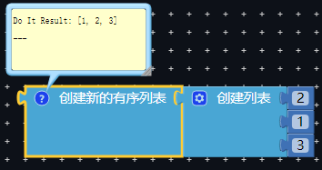
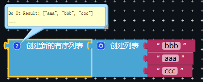
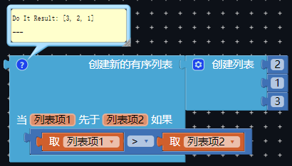
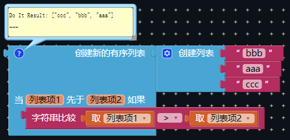
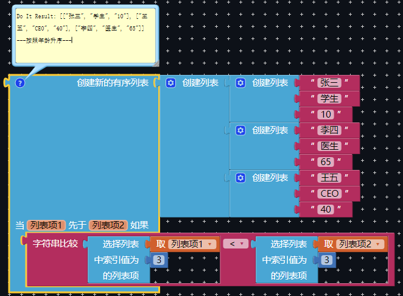
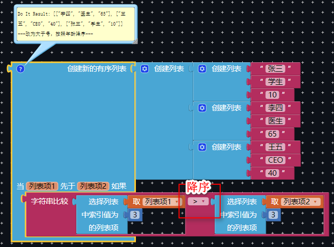
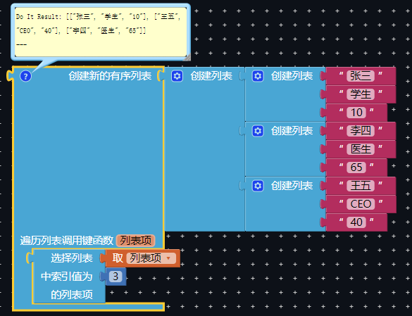
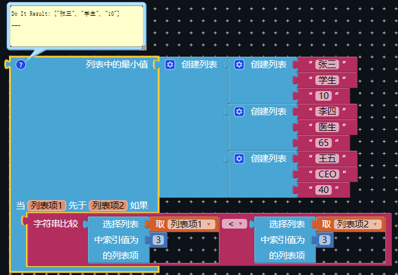
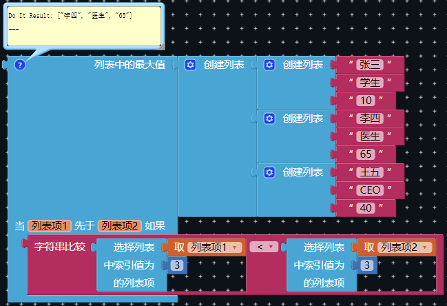

* TOC
{:toc}

[&laquo; 返回首页](index.html)

本文主要介绍 [列表](../blocks/lists.html#sort) 的高级用法，即函数式编程，可以按照指定的逻辑进行列表的排序，而无需我们自己写代码实现排序功能。

指定的逻辑也包括很复杂的逻辑，也就是说如果你的排序逻辑很复杂，函数式编程就是最好的使用场景。

## 基本数据类型（文本和数字）升序

## 基本数据类型（文本和数字）降序

这时就要用到函数式编程了，按照函数中指定的逻辑进行排序：

{:.vip}

{:.vip}

可以看到仅仅就是对前后两个元素进行比较，大于号是降序（小于号升序，效果和第一种一样），要注意的是，比较函数最好用各自的（文本用字符串比较，数字用数字比较块）。

## 复杂结构类型中指定元素的升/降序

{:.vip}

函数体中写法的含义：参数是二维列表中的列表项，也就是某个人的对象，如`["张三","学生","10"]`，它本身也是一个列表，我们要把第三个元素也就是年龄至拿出来作比较。

{:.vip}

只要把比较的逻辑反一下，排序的顺序也会相反，变成了降序。

有了这种排序方法，我们再也不用去重复造轮子自己写排序算法了，几个代码块就能搞定，so easy！

## 列表其他函数式编程用法

用法也是一样的。按指定数据升序排序：

{:.vip}

取列表中最小值：

{:.vip}

取列表中最大值：

{:.vip}
