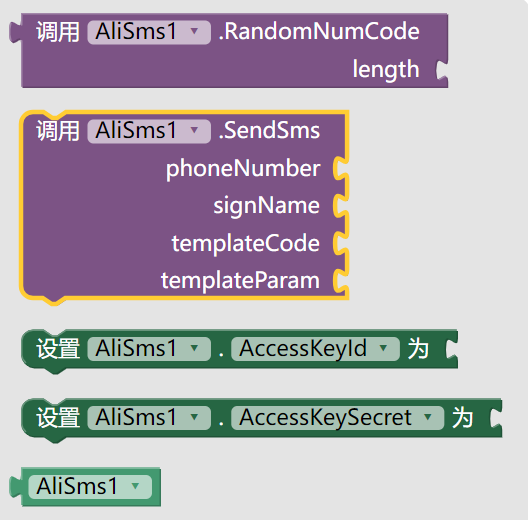
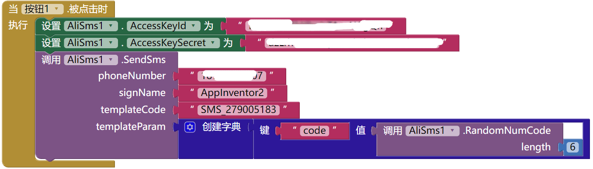

* TOC
{:toc}

[&laquo; 返回首页](index.html)

发送短信验证码功能一般都是基于短信平台提供的sdk进行调用，这里是基于阿里云短信平台进行的开发，阿里云短信平台[点此开通](https://www.aliyun.com/product/sms?userCode=qpd7410l)，接入步骤请[点此参考](https://help.aliyun.com/zh/sms/user-guide/usage-notes?userCode=qpd7410l)。

## App Inventor 2 中文网原创开发阿里短信平台接入拓展

提供的函数如下：

主要提供2个函数，生成随机位数的数字随机码 和 发送短信，需要填入AccessKey ID和Access Secret，发送短信的参数：手机号，签名名称，模板CODE，模板参数JSON。

发送函数不仅仅发送验证码，而是通用的短信模板参数，可以**发送任意短信模板的短信内容！**

### 短信发送代码参考：

### 发送效果参考如下：

## 拓展获取

收费拓展，如有需要请页面右侧栏扫码添加客服进行咨询，谢谢~
