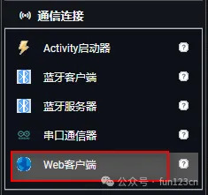

* TOC
{:toc}

[&laquo; 返回首页](index.html)

首先，需要使用 [Web客户端](../components/connectivity.html#Web) 组件，需要和网络url进行数据交互的场景就要考虑使用它，[Web客户端](../components/connectivity.html#Web) 组件在“通信连接”抽屉中：

设置好网络图片的url，然后执行Get方法即可，代码如下：

{:.vip}

{:.vip}
其中，特别要注意的是[`保存响应信息`](../components/connectivity.html#Web.SaveResponse)属性设置为`真`，这样才能将目标网络图片保存到本地设备。如果不指定[`响应文件名称`](../components/connectivity.html#Web.ResponseFileName)属性，则保存在本地的图片文件默认是以时间戳作为文件名的一部分的，如下：

重新请求一次，文件名发生了变化：

{:.vip}
指定[`响应文件名称`](../components/connectivity.html#Web.ResponseFileName)属性，则图片文件名就是指定的名称：

{:.vip}

重新请求一次，会图片文件会原路径进行覆盖。
