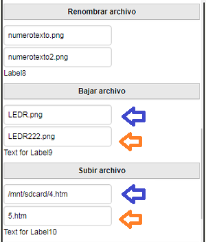

* TOC
{:toc}

[&laquo; 返回首页](index.html)

目前只能使用拓展，包括一款免费的和几款收费的。

## KIO FTPCliente
<!--http://kio4.com/appinventor/274_extensiones_clienteftp_hora.htm-->

在上传和下载文件的部分，您将在每个文件中看到两个文本字段，这是因为源文件可能有一个名称，而当它上传时，它有另一个名称，也就是说，如果我放置源：work.txt 和目标 mynewwork.txt，当它上升到服务器时，它将采用 mynewwork.txt 的名称。 如果需要，可以在源和目标中放置相同的名称。

- 在几个块中，您将看到注释：“如果您在路径中，则只能输入文件名。

- 这意味着您可以输入完整地址，例如：/public_html/mi_directorio/file.txt

- 或者，如果当前目录是 /public_html/mi_directorio。只需放置：.txt文件

- 用户在运行应用程序时必须接受对 SdCard 的读写权限：

  * READ_EXTERNAL_STORAGE
  * WRITE_EXTERNAL_STORAGE

.aix 拓展下载：

{:.vip}
[com.KIO4_FTPCliente.aix](ftp/com.KIO4_FTPCliente.aix)

demo 下载：

{:.vip}
[KIO4_FTPCliente_demo.aia](ftp/KIO4_FTPCliente_demo.aia)

## TaifunFTP （收费的:$12，请自行研究）

地址：[https://puravidaapps.com/ftp.php](https://puravidaapps.com/ftp.php)

## FTPClient （收费的:$5，请自行研究）

地址：[https://community.appinventor.mit.edu/t/paid-ftpclient-an-extension-to-communicate-to-remote-server-5-or-inr-350/23519](https://community.appinventor.mit.edu/t/paid-ftpclient-an-extension-to-communicate-to-remote-server-5-or-inr-350/23519)

