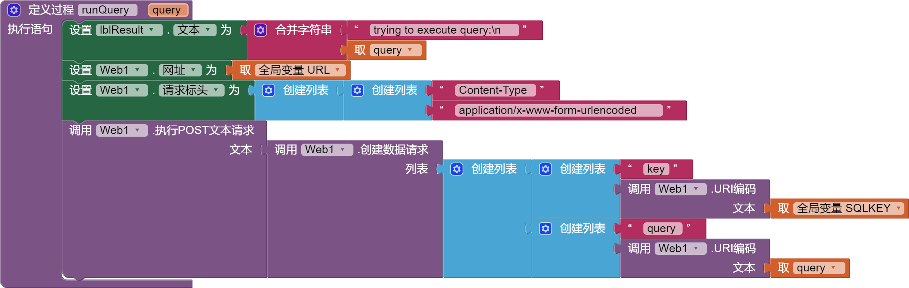

* TOC
{:toc}

[&laquo; 返回首页](index.html)

<!--https://puravidaapps.com/mysql.php-->

由于阿里数据库（Oceanbase）完全兼容 MySQL，因此这里探讨的就是怎么连MySQL。

## App Inventor 2 如何连接MySQL数据库

首先，App Inventor 2 并没有提供直接连接 MySQL 的方式，也没有现成的拓展。

经过官方资料查找，目前仅有的方案是利用  `Web客户端` 将你的查询请求 Post 到你自己的服务器，服务器提供 php 代码代理执行你的 sql 给 MySQL。

先看效果：


### 开发步骤

1. 将 PHP 代码放在 Web 服务器上
1. 在应用和 PHP 代码中设置 SQLKEY，它们必须匹配才能使此代码正常工作，以保障安全（注意：请不要使用特殊字符）
1. 在 php 脚本中设置数据库连接信息
1. 测试代码

**注意事项：**
* 返回 HTTP 代码 200 表示SELECT 查询成功
* 返回 HTTP 代码 201 表示不是有效的 SELECT 查询
* 返回 HTTP 代码 400，表示 SQL 查询错误
* 请注意SQL注入风险，加强php代码的检查逻辑

## 前端代码块

执行sql语句的代码块，参考如下：



服务器响应处理代码块，参考如下：


.aia源码下载：

{:.vip}
[mysql.aia](mysql/mysql.aia)

## 后端php代码

php参考代码如下：

{:.vip}
```php
<?php
/*
 * Written By: ShivalWolf
 * Date: 2011/06/03
 * Contact: Shivalwolf@domwolf.net
 *
 * UPDATE 2011/04/05
 * The code now returns a real error message on a bad query with the mysql error number and its error message
 * checks for magic_quotes being enabled and strips slashes if it is. Its best to disable magic quotes still.
 * Checks to make sure the submitted form is a x-www-form-urlencode just so people dont screw with a browser access or atleast try to
 * Forces the output filename to be JSON to conform with standards
 *
 * UPDATE 2011/06/03
 * Code updated to use the Web Module instead of tinywebdb
 *
 * UPDATE 2013/12/26 and 2014/02/18
 * minor modifications by Taifun, puravidaapps.com
 *
 * UPDATE 2014/07/11
 * mysql API (deprecated) replaced by mysqli by Taifun
 *
 * UPDATE 2015/04/30
 * SELECT logic adjusted (result stored in temp. file removed) by Taifun
 *
 * UPDATE 2016/02/21
 * Bugfix Undefined variable: csv
 */

/************************************CONFIG****************************************/
//DATABSE DETAILS//
$DB_ADDRESS="";
$DB_USER="";
$DB_PASS="";
$DB_NAME="";

//SETTINGS//
//This code is something you set in the APP so random people cant use it.
$SQLKEY="secret";

/************************************CONFIG****************************************/

//these are just in case setting headers forcing it to always expire
header('Cache-Control: no-cache, must-revalidate');

error_log(print_r($_POST,TRUE));

if( isset($_POST['query']) && isset($_POST['key']) ){                                   //checks if the tag post is there and if its been a proper form post
  //set content type to CSV (to be set here to be able to access this page also with a browser)
  header('Content-type: text/csv');

  if($_POST['key']==$SQLKEY){                                                           //validates the SQL key
    $query=urldecode($_POST['query']);
    if(get_magic_quotes_gpc()){     //check if the worthless pile of crap magic quotes is enabled and if it is, strip the slashes from the query
      $query=stripslashes($query);
    }
    $conn = new mysqli($DB_ADDRESS,$DB_USER,$DB_PASS,$DB_NAME);    //connect

    if($conn->connect_error){                                                           //checks connection
      header("HTTP/1.0 400 Bad Request");
      echo "ERROR Database Connection Failed: " . $conn->connect_error, E_USER_ERROR;   //reports a DB connection failure
    } else {
      $result=$conn->query($query);                                                     //runs the posted query
      if($result === false){
        header("HTTP/1.0 400 Bad Request");                                             //sends back a bad request error
        echo "Wrong SQL: " . $query . " Error: " . $conn->error, E_USER_ERROR;          //errors if the query is bad and spits the error back to the client
      } else {
        if (strlen(stristr($query,"SELECT"))>0) {                                       //tests if it's a SELECT statement
          $csv = '';                                                                    // bug fix Undefined variable: csv
          while ($fieldinfo = $result->fetch_field()) {
            $csv .= $fieldinfo->name.",";
          }
          $csv = rtrim($csv, ",")."\n";
          echo $csv;                                                                    //prints header row
          $csv = '';

          $result->data_seek(0);
          while($row = $result->fetch_assoc()){
            foreach ($row as $key => $value) {
              $csv .= $value.",";
            }
            $csv = rtrim($csv, ",")."\n";
          }
          echo $csv;                                                                    //prints all data rows
        } else {
          header("HTTP/1.0 201 Rows");
          echo "AFFECTED ROWS: " . $conn->affected_rows;       //if the query is anything but a SELECT, it will return the number of affected rows
        }
      }
      $conn->close();                                          //closes the DB
    }
  } else {
     header("HTTP/1.0 400 Bad Request");
     echo "Bad Request";                                       //reports if the secret key was bad
  }
} else {
        header("HTTP/1.0 400 Bad Request");
        echo "Bad Request";
}
?>
```


