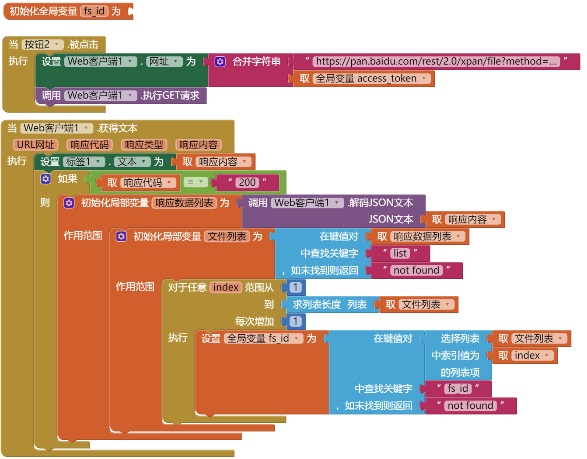

* TOC
{:toc}

[&laquo; 返回首页](index.html)

## App Inventor 2 接入百度网盘API

### 1、[申请应用](https://pan.baidu.com/union/doc/fl0hhnulu)

AppID [AppID]

AppKey [AppKey]

Secretkey [暂时用不到]

Signkey [暂时用不到]

***
### 2、用户登录认证，拿到access_token，后续请求必备参数 【使用Web浏览框】

[接入文档](https://pan.baidu.com/union/document/basic)

使用Web浏览框，里面要输入网盘用户名密码，成功后返回的url中拿出access_token

这里使用[`简单模式`](https://pan.baidu.com/union/doc/6l0ryrjzv)，回调网页，在回调后的URL中拿出access_token，后面操作都需要它：

> http://openapi.baidu.com/oauth/2.0/authorize?display=mobile&response_type=token&client_id=[AppKey]&redirect_uri=oob&scope=basic,netdisk

**请注意**：手机的话，必须将 `display=mobile` 加上，以展示手机版的授权画面（电脑版极有可能在手机上不能完美展示）。

access_token=[access_token]    有效期：根据文档，有效期大概30天

拿 access_token 的逻辑如下：

***
### 3、获取文件列表，返回JSON，拿出想要的文件的fsid 【使用Web客户端】

> https://pan.baidu.com/rest/2.0/xpan/file?method=list&dir=/test&order=time&start=0&limit=10&web=web&folder=0&access_token=[access_token]&desc=1

参考代码如下：

**注意**：这里是限定显示第一页，每页 10 条，可以改请求参数拿更多的文件：`start=0&limit=10`，比如10改为1000等。

***
### 4、获取文件信息，返回JSON，根据fsid取出dlink 【使用Web客户端】

> http://pan.baidu.com/rest/2.0/xpan/multimedia?access_token=[access_token]&method=filemetas&fsids=[1737895653506]&thumb=1&dlink=1&extra=1

***
### 5、根据dlink下载 【Web客户端】

> https://d.pcs.baidu.com/file/330eb0451pf47ab8514ab5b6f0095c67?fid=2584198580-250528-1737895653506&rt=pr&sign=FDtAERV-DCb740ccc5511e5e8fedcff06b081203-l1%2FQEmhrWYz44QzUHHhKQpLLZfk%3D&expires=8h&chkbd=0&chkv=3&dp-logid=2874731127723614236&dp-callid=0&dstime=1697013275&r=649469325&origin_appid=[AppID]&file_type=0

注意：这个dlink可以在浏览器中直接访问，下载。但是如果使用Web客户端的话，会响应 302 错误。

这是由于这个dlink是一个302跳转，要再次跳转到实际下载地址，这里考虑使用类似点击链接的方式，下载文件，测试可用。

参考代码如下：

<!--注意：dlink中需转义   \u0026  ->  &-->
