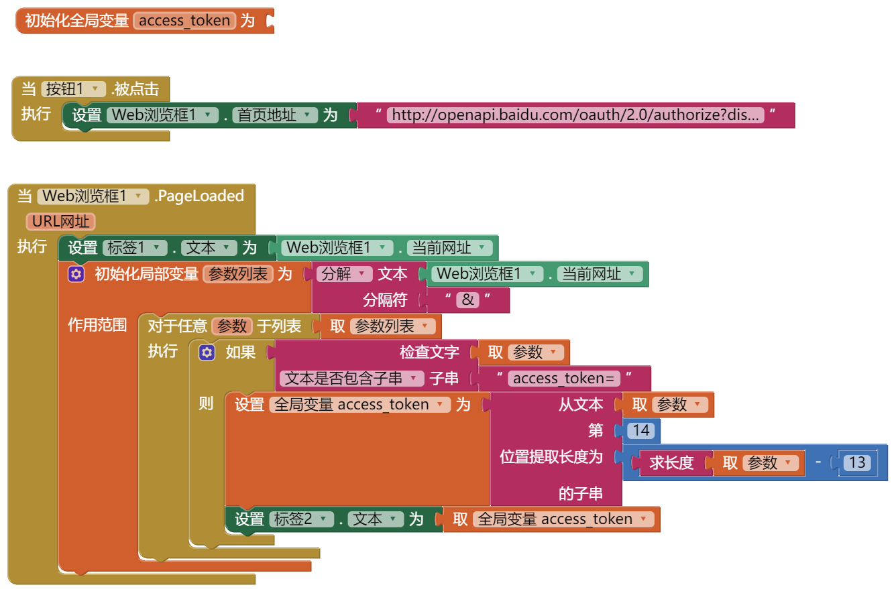

* TOC
{:toc}

[&laquo; 返回首页](index.html)

## App Inventor 2 接入百度网盘API：文件上传

### 1、[申请应用](https://pan.baidu.com/union/doc/fl0hhnulu)

AppID [AppID]

AppKey [AppKey]

Secretkey [暂时用不到]

Signkey [暂时用不到]

***
### 2、用户登录认证，拿到access_token，后续请求必备参数 【使用Web浏览框】

[接入文档](https://pan.baidu.com/union/document/basic)

使用Web浏览框，里面要输入网盘用户名密码，成功后返回的url中拿出access_token

这里使用[`简单模式`](https://pan.baidu.com/union/doc/6l0ryrjzv)，回调网页，在回调后的URL中拿出access_token，后面操作都需要它：

> http://openapi.baidu.com/oauth/2.0/authorize?display=mobile&response_type=token&client_id=[AppKey]&redirect_uri=oob&scope=basic,netdisk

**请注意**：手机的话，必须将 `display=mobile` 加上，以展示手机版的授权画面（电脑版极有可能在手机上不能完美展示）。

access_token=[access_token]    有效期：根据文档，有效期大概30天

拿 access_token 的逻辑如下：

***
### 3、
