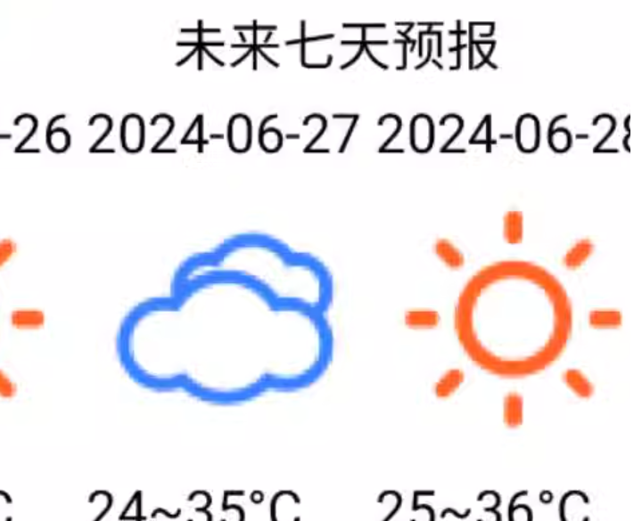
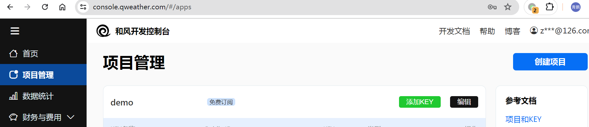
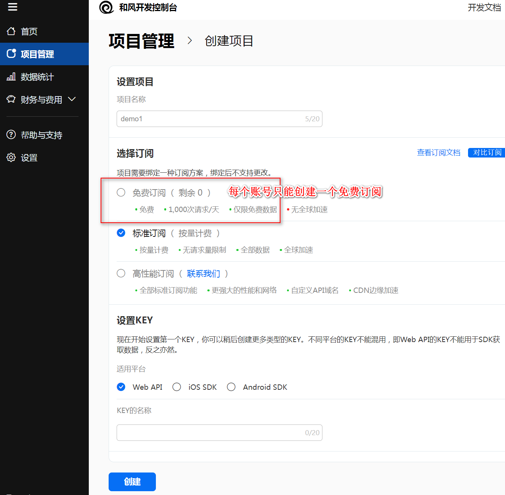
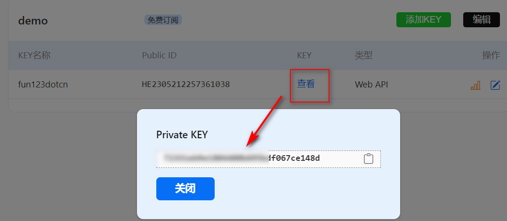
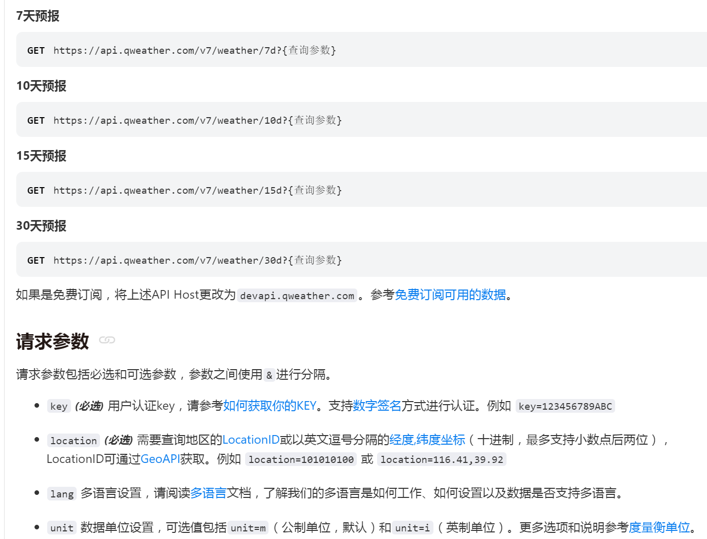
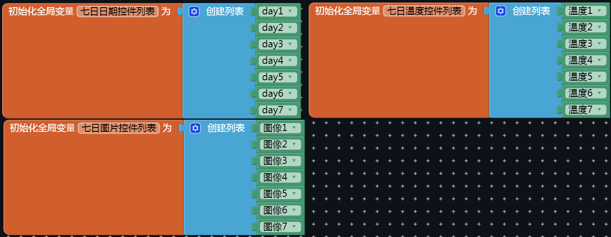
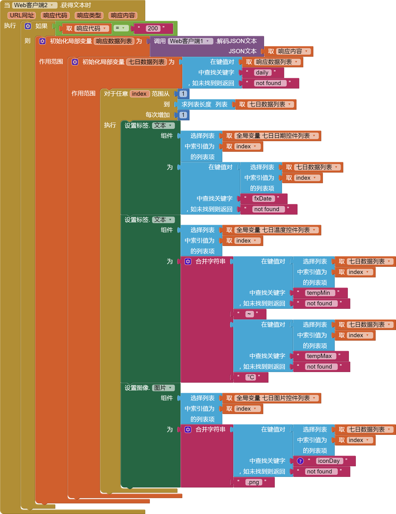

* TOC
{:toc}

[&laquo; 返回首页](index.html)

App效果图，展示未来7日的天气预报，包括日期、天气图示和温度：



### App原理介绍

通过调用第三方天气api，填入必要的参数，通过Web客户端请求url。返回json格式的数据结果，使用AppInventor2解析json结果，显示到App上即可。

## 第三方天气API介绍

第三方天气的api平台特别多，这里仅以“和风天气”（`dev.qweather.com`）作为演示，其他平台的使用方法都是几乎一样的。

平台的注册及登录步骤请自行完成，登录后需要创建一个项目以获得API调用时必要的用户认证`key`。

### 创建一个项目



### 填写必要的参数



### 查看已创建的项目



这时，我们就能得到了用户认证`key`，后续步骤会用到这个关键的数据。

### 查看API文档，确定我们需要准备的数据



通过文档可知，我们需要在url中替换填入自己的`key`。

### 请求示例：北京7天预报

```api
curl -L -X GET --compressed 'https://api.qweather.com/v7/weather/7d?location=101010100&key=YOUR_KEY'
```

## 第三方API的调用

使用”Web客户端“组件调用第三方API，代码如下：

{:.vip}

## JSON结果的解析

### 请求成功返回JSON示例

```json
{
  "code": "200",
  "updateTime": "2021-11-15T16:35+08:00",
  "fxLink": "http://hfx.link/2ax1",
  "daily": [
    {
      "fxDate": "2021-11-15",
      "sunrise": "06:58",
      "sunset": "16:59",
      "moonrise": "15:16",
      "moonset": "03:40",
      "moonPhase": "盈凸月",
      "moonPhaseIcon": "803",
      "tempMax": "12",
      "tempMin": "-1",
      "iconDay": "101",
      "textDay": "多云",
      "iconNight": "150",
      "textNight": "晴",
      "wind360Day": "45",
      "windDirDay": "东北风",
      "windScaleDay": "1-2",
      "windSpeedDay": "3",
      "wind360Night": "0",
      "windDirNight": "北风",
      "windScaleNight": "1-2",
      "windSpeedNight": "3",
      "humidity": "65",
      "precip": "0.0",
      "pressure": "1020",
      "vis": "25",
      "cloud": "4",
      "uvIndex": "3"
    },
    {
      "fxDate": "2021-11-16",
      "sunrise": "07:00",
      "sunset": "16:58",
      "moonrise": "15:38",
      "moonset": "04:40",
      "moonPhase": "盈凸月",
      "moonPhaseIcon": "803",
      "tempMax": "13",
      "tempMin": "0",
      "iconDay": "100",
      "textDay": "晴",
      "iconNight": "101",
      "textNight": "多云",
      "wind360Day": "225",
      "windDirDay": "西南风",
      "windScaleDay": "1-2",
      "windSpeedDay": "3",
      "wind360Night": "225",
      "windDirNight": "西南风",
      "windScaleNight": "1-2",
      "windSpeedNight": "3",
      "humidity": "74",
      "precip": "0.0",
      "pressure": "1016",
      "vis": "25",
      "cloud": "1",
      "uvIndex": "3"
    },
    {
      "fxDate": "2021-11-17",
      "sunrise": "07:01",
      "sunset": "16:57",
      "moonrise": "16:01",
      "moonset": "05:41",
      "moonPhase": "盈凸月",
      "moonPhaseIcon": "803",
      "tempMax": "13",
      "tempMin": "0",
      "iconDay": "100",
      "textDay": "晴",
      "iconNight": "150",
      "textNight": "晴",
      "wind360Day": "225",
      "windDirDay": "西南风",
      "windScaleDay": "1-2",
      "windSpeedDay": "3",
      "wind360Night": "225",
      "windDirNight": "西南风",
      "windScaleNight": "1-2",
      "windSpeedNight": "3",
      "humidity": "56",
      "precip": "0.0",
      "pressure": "1009",
      "vis": "25",
      "cloud": "0",
      "uvIndex": "3"
    }
  ],
  "refer": {
    "sources": [
      "QWeather",
      "NMC",
      "ECMWF"
    ],
    "license": [
      "QWeather Developers License"
    ]
  }
}
```

### JSON解析参考代码



{:.vip}

## aia源码

通过上面的步骤拆解及代码块参考，相信你一定能够完成基本功能的开发，这里不直接提供免费源码，提倡自己动手实操！

[点此自助购买](https://www.fun123.cn/aia-store/240714104453242?f=doc){:.store} 以上演示的aia源码。

